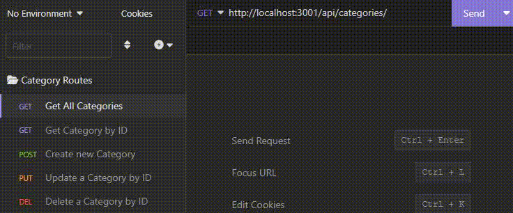
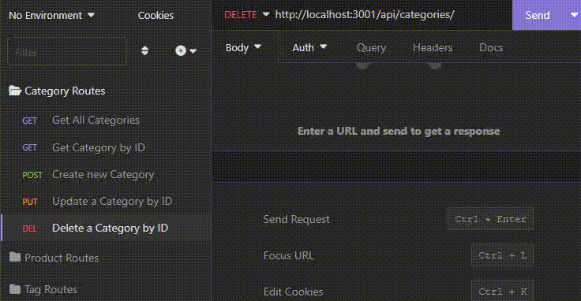

# E-Commerce Back End

## Description

A simple Sequelize and MySQL2 backend database mock-up for e-commerce.

Utilizing Sequelize I constructed a simple database comprised of four tables that all dynamically pull information from one another using foreign keys.

I wanted to get more well acquainted with the world of ORMs and building a mock-up back end database for e-commerce was a great way to do so. I was forced to learn how to properly use models to construct a database instead of a base schema.sql, as well as how to properly construct API routes using Sequelize instead of MySQL. All in all this project was a great introduction to Sequelize and all the things that are made simpler with its use.

---

## Installation

To install the application you'll need to do the following:

- Clone the repository to your local machine
- Navigate to the project repository
- Change the information in the .env file to match your MySQL login information
- Type `npm install` in the terminal to install dependencies
- Log in to MySQL in your terminal
- Run the command `source db/schema.sql` to create the database, then exit the MySQL shell by typing `exit` in your terminal
- Run the command `npm run seed` to seed the database using the files within the ./seeds folder
- Run the command `npm run watch` to start the local server

---

## Usage

A short video demonstration can be found here: NOT YET IMPLEMENTED

After the necessary dependencies have been installed, you have created and seeded the database, and you have started the local server by running the `npm run watch` command you can view various tables and their corresponding foreign keys using an API development platform like Insomnia, Postman, or other alternatives.

---

You can perform a Get operation to display all items in a given category, all products, or all tags. You can also search by a specific ID by performing the same Get operation with the id you wish to search for as the endpoint.

You can perform a Post operation to create a new category, product, or tag. You can also update an items name by ID, as well as delete an item by ID.

!

---

## Technologies

- [dotenv](https://www.npmjs.com/package/dotenv) - Used to hide MySQL login information and specify database to use.
- [Express](https://expressjs.com/) - Back-end web app framework for building RESTful APIs with Node.js.
- [Mysql2](https://www.npmjs.com/package/mysql2) - MySQL client for Node.js, dependency of Sequelize
- [Sequelize](https://sequelize.org/) - Node.js ORM for MySQL.

---